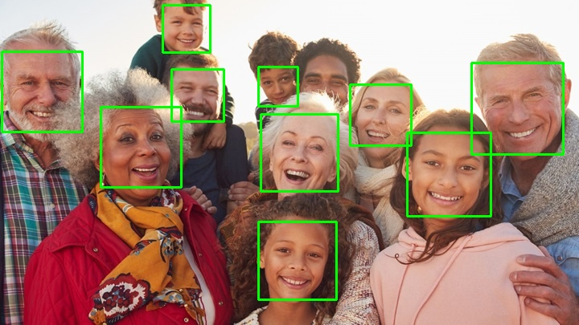
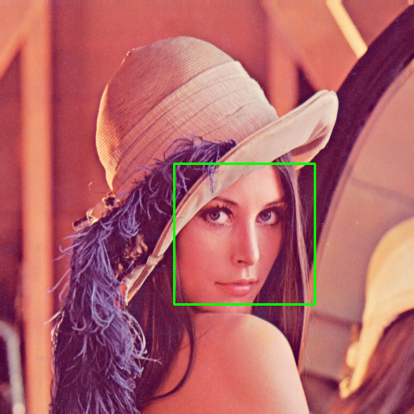

# Face-detector

Single image face detector using cascade classifiers / opencv on C++

## Usage

To detect faces in an image, run:

```bash
cmake -B ./build -S . -DCMAKE_TOOLCHAIN_FILE=<path to vcpkg>/scripts/buildsystems/vcpkg.cmake
cmake --build ./build
./build/DetectFaces.app <path-to-image>
```

Output with faces detected will be saved to `<path-to-image>.faces.png`

I strongly suggest you to download vcpkg and install opencv.

## Example Output


